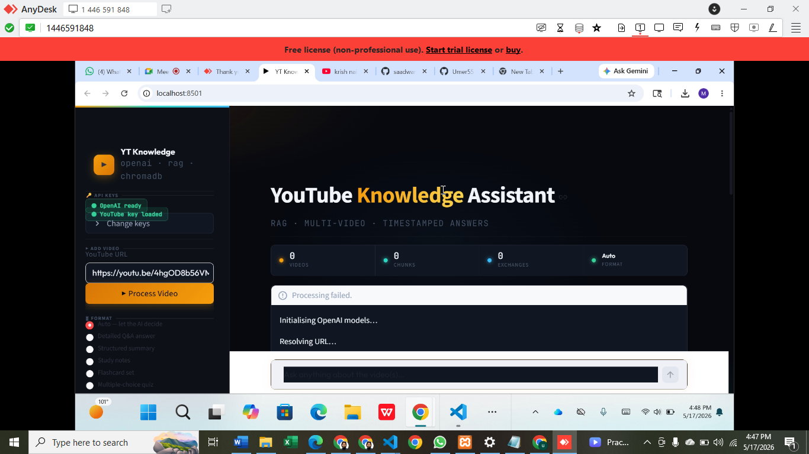

# YouTube Knowledge Assistant

A multi-video RAG (Retrieval-Augmented Generation) chatbot that lets you **chat with YouTube videos** and get accurate, timestamped answers — powered by GPT-4o-mini, LangChain, and ChromaDB.

> **Final Year Project** — Goes beyond basic YouTube Q&A with cross-video comparison, comment sentiment analysis, flashcard and quiz generation, and smart intent-based query routing.

---

## Interface



*Dark glassmorphism UI with a collapsible sidebar, real-time stats, and white chat bubbles for readable responses.*

---

## Features

| Feature | Description |
|---|---|
| **Multi-Video Ingestion** | Load single videos, playlists, or entire channels from any YouTube URL |
| **Timestamped Answers** | Every answer links back to the exact moment in the video |
| **Cross-Video Comparison** | Compare perspectives, arguments, and facts across multiple videos |
| **Comment Sentiment Analysis** | Understand viewer reaction using VADER + LLM-clustered themes |
| **Smart Intent Routing** | Auto-detects Q&A, summarize, compare, sentiment, quiz, or flashcard intent |
| **Flashcards & Quizzes** | Auto-generate study materials directly from video content |
| **Conversation Memory** | Follow-up questions work naturally — context preserved across turns |
| **Auto Transcript Fallback** | Uses YouTube captions first; falls back to Whisper if unavailable |

---

## Architecture

```
User → Streamlit UI
         │
         ▼
    URL Parser (video / playlist / channel)
         │
    ┌────┴──────────────────────────┐
    │ Transcript Engine             │  Comment Fetcher
    │ youtube-transcript-api        │  (YouTube Data API v3)
    │ └─ Whisper fallback           │
    └────┬──────────────────────────┘
         │                          │
         ▼                          ▼
  Timestamp-Aware             Sentiment Analysis
  Chunker (1500 chars)        VADER + LLM Clustering
         │                          │
         ▼                          ▼
  text-embedding-3-small      SQLite Metadata Store
  (OpenAI Embeddings)
         │
         ▼
  ChromaDB Vector Store
         │
         ▼
  Multi-Query MMR Retriever (K=6, λ=0.75)
         │
         ▼
  ┌──────────────────────────────────────┐
  │         Query Router (GPT-4o-mini)   │
  │  factual_qa │ summarize │ compare    │
  │  sentiment  │ quiz      │ flashcards │
  └──────────────────┬───────────────────┘
                     │
                     ▼
            GPT-4o-mini Response
            + Timestamped Sources
```

---

## Tech Stack

| Layer | Technology | Purpose |
|---|---|---|
| **Frontend** | Streamlit | Chat UI, sidebar, real-time stats |
| **Orchestration** | LangChain (LCEL) | RAG pipeline, chains, routing |
| **LLM** | GPT-4o-mini | Generation, classification, analysis |
| **Embeddings** | text-embedding-3-small | 1536-dim semantic search vectors |
| **Vector Store** | ChromaDB | Persistent transcript embeddings |
| **Metadata DB** | SQLite | Video info, sentiment, chat history |
| **Transcripts** | youtube-transcript-api + Whisper | Caption extraction with fallback |
| **Comments** | YouTube Data API v3 | Viewer comment fetching |
| **Sentiment** | VADER + LLM | Polarity scoring + theme clustering |

---

## Quick Start

### Prerequisites

- Python 3.10+
- OpenAI API key — [platform.openai.com/api-keys](https://platform.openai.com/api-keys)
- YouTube Data API v3 key *(optional, for comment sentiment)* — [Google Cloud Console](https://console.cloud.google.com/apis/credentials)

### Installation

```bash
# Clone the repo
git clone https://github.com/Umer553/Youtube_knowledge_assistant.git
cd Youtube_knowledge_assistant

# Create virtual environment
python -m venv .venv
.venv\Scripts\activate        # Windows
# source .venv/bin/activate   # macOS / Linux

# Install dependencies
pip install -r requirements.txt

# Configure environment
cp .env.example .env
# Open .env and fill in your OPENAI_API_KEY
```

### Run

```bash
streamlit run app/main.py
```

Opens at `http://localhost:8501`. API keys from `.env` are loaded automatically — no manual entry needed.

---

## Usage

### 1 — Paste a YouTube URL

Any of these formats work:

```
https://www.youtube.com/watch?v=VIDEO_ID
https://youtu.be/VIDEO_ID
https://www.youtube.com/playlist?list=PLAYLIST_ID
https://www.youtube.com/c/ChannelName
```

### 2 — Click Process Video

The pipeline runs automatically:
- Fetches transcript (captions → Whisper fallback)
- Chunks into 1500-char segments with 200-char overlap
- Embeds with `text-embedding-3-small`
- Indexes into ChromaDB

### 3 — Chat

Ask anything about the video content:

| Query | Intent Detected | What You Get |
|---|---|---|
| *"What is the main topic?"* | `factual_qa` | Direct answer with timestamp links |
| *"Summarize this video"* | `summarize` | Structured summary with section breakdown |
| *"Compare both videos on topic X"* | `compare_videos` | Side-by-side synthesis across loaded videos |
| *"What do viewers think about this?"* | `sentiment_query` | Viewer sentiment + comment theme clusters |
| *"Generate flashcards"* | `generate_flashcards` | Q&A card pairs from video content |
| *"Create a quiz"* | `generate_quiz` | MCQ quiz with answers and explanations |

### 4 — Choose Output Format

Use the **Format** selector in the sidebar to pin a specific output style (Detailed Answer, Summary, Study Notes, Flashcards, Quiz, Compare) or leave it on **Auto** to let the router decide.

---

## Project Structure

```
Youtube_knowledge_assistant/
├── app/
│   ├── main.py                  # Streamlit entry point + session state
│   ├── config.py                # All tunable constants + API keys
│   └── components/
│       └── styles.py            # Complete CSS (glassmorphism dark theme)
├── core/
│   ├── ingestion/
│   │   ├── url_parser.py        # Resolves video/playlist/channel URLs
│   │   ├── transcript.py        # Caption extraction + Whisper fallback
│   │   └── comments.py          # YouTube Data API comment fetching
│   ├── processing/
│   │   ├── chunker.py           # Timestamp-aware text splitting
│   │   ├── embedder.py          # OpenAI / HuggingFace embedding wrapper
│   │   └── sentiment.py         # VADER + LLM theme clustering
│   ├── retrieval/
│   │   ├── vector_store.py      # ChromaDB wrapper (add, query, filter)
│   │   ├── retriever.py         # Multi-query MMR retriever (LCEL)
│   │   └── metadata_store.py    # SQLite: videos, sentiment, chat history
│   └── chains/
│       ├── router.py            # LLM-based intent classification
│       ├── qa_chain.py          # Q&A with conversation memory
│       ├── summary_chain.py     # Structured video summarization
│       ├── compare_chain.py     # Cross-video comparison synthesis
│       ├── sentiment_chain.py   # Sentiment-aware response generation
│       └── formatter.py         # Flashcard and MCQ quiz generation
├── docs/
│   └── screenshot.png           # UI screenshot
├── data/                        # ChromaDB + SQLite (git-ignored)
├── test_pipeline.py             # End-to-end CLI test (no browser needed)
├── .env.example                 # Environment variable template
├── requirements.txt
└── README.md
```

---

## Configuration

All tunable constants live in `app/config.py`:

| Constant | Value | Effect |
|---|---|---|
| `LLM_MODEL` | `gpt-4o-mini` | LLM used for all chains |
| `EMBEDDING_MODEL` | `text-embedding-3-small` | Embedding model |
| `LLM_TEMPERATURE` | `0.7` | Response creativity (0 = deterministic, 1 = creative) |
| `LLM_MAX_TOKENS` | `2048` | Maximum response length |
| `CHUNK_SIZE` | `1500` | Characters per transcript chunk |
| `CHUNK_OVERLAP` | `200` | Overlap between consecutive chunks |
| `RETRIEVER_K` | `6` | Top-K chunks retrieved per query |
| `MMR_LAMBDA` | `0.75` | Relevance vs diversity balance in MMR |
| `MULTI_QUERY_COUNT` | `3` | Query variations generated per user question |
| `MEMORY_WINDOW_SIZE` | `10` | Conversation turns kept in context |

---

## Environment Variables

Copy `.env.example` to `.env` and fill in:

```env
# Required
OPENAI_API_KEY=sk-proj-...

# Optional — enables comment sentiment analysis
YOUTUBE_API_KEY=AIza...
```

---

## Running Tests

```bash
# End-to-end pipeline test (no browser, no UI)
python test_pipeline.py
```

Tests all 6 stages: config → transcript → chunking → embeddings → ChromaDB → LLM QA.

---

## Key Design Decisions

**Multi-query MMR retrieval** — For each user question, the retriever generates 3 query variations using the LLM, fetches results for all, then re-ranks with Maximum Marginal Relevance to balance relevance and diversity. This significantly improves recall for ambiguous questions.

**Per-video metadata filtering** — ChromaDB documents are tagged with `video_id`, allowing the compare chain to retrieve chunks from specific videos independently before synthesizing a comparison.

**Timestamp preservation** — Chunks retain `start_time` and `end_time` from the original transcript segments. Every retrieved chunk can be traced back to a specific second in the video.

**Intent routing** — A lightweight LLM call classifies every query into one of 6 intents before choosing a chain. This avoids running an expensive retrieval + generation for queries that need a different pipeline (e.g., sentiment queries that need comment data).

---

## Acknowledgments

- [LangChain](https://langchain.com) — RAG orchestration framework
- [ChromaDB](https://trychroma.com) — Open-source vector database
- [OpenAI](https://openai.com) — GPT-4o-mini and text-embedding-3-small
- [Streamlit](https://streamlit.io) — Python-native web UI framework
- [youtube-transcript-api](https://github.com/jdepoix/youtube-transcript-api) — Transcript extraction
- [openai-whisper](https://github.com/openai/whisper) — Speech-to-text fallback

---

## License

Built for educational purposes as a Final Year Project.
